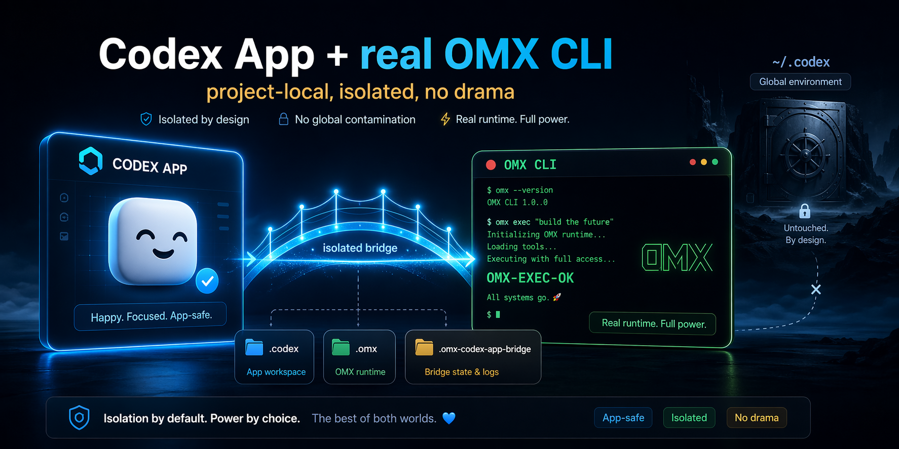

# OMX Codex App Bridge

Bridge `oh-my-codex` (OMX) into Codex App safely by keeping the real OMX runtime in the shell and the App session honest about what is and is not active.

This repo ships a single public skill, `omx-codex-app-bridge`, plus a shell wrapper that:

- bootstraps upstream [`Yeachan-Heo/oh-my-codex`](https://github.com/Yeachan-Heo/oh-my-codex) locally
- keeps OMX project-local under `./.codex`, `./.omx`, and `./.omx-codex-app-bridge`
- avoids global `npm -g` installs
- avoids upstream `postinstall` side effects by building with `npm --ignore-scripts`
- gives Codex App a safe contract: App-safe guidance by default, real OMX runtime only when launched from the shell

## Requirements

- Codex with the built-in `skill-installer` system skill available
- `git`
- `node`
- `npm`

## Security model

This bridge is safer than a global OMX install, but it is not a sandbox.

- `./.codex/` isolation separates auth, config, skills, and runtime state from `~/.codex`
- it does **not** restrict filesystem, network, or subprocess access available to your user account
- safe defaults reduce surprise, but only the underlying Codex sandbox and approval settings control model execution privileges

The wrapper therefore uses these launch modes:

- `launch`: safe default, runs upstream OMX with `--high`
- `launch-dangerous`: explicit dangerous mode, runs upstream OMX with `--madmax --high`

Use `launch-dangerous` only when you intentionally want upstream OMX to bypass Codex approvals and sandboxing.

## Why this exists

The upstream OMX README says Codex App is not the default experience and may behave inconsistently. This bridge does not try to fake OMX runtime behavior inside the App.

Instead, it teaches the App-side agent to do two things correctly:

1. Stay App-safe when the user only wants planning, clarification, or native Codex help.
2. Launch the actual OMX runtime from the shell when the user explicitly wants real OMX behavior.

That split is the core safety rule.

## What gets created in a target project

When you use the wrapper from a project directory, state stays local to that project:

- `./.codex/` for the isolated Codex home used by OMX
- `./.omx/` for upstream OMX runtime state
- `./.omx-codex-app-bridge/` for the local OMX checkout, wrapper logs, and bridge metadata

The wrapper never copies or syncs `~/.codex/auth.json`, `~/.codex/config.toml`, or other global Codex files.

## Skill layout

```text
skills/
└── omx-codex-app-bridge/
    ├── SKILL.md
    ├── agents/openai.yaml
    └── scripts/omx-bridge.sh
```

When Codex uses the installed skill, the wrapper path should be resolved from the skill directory, not from the user's repository:

```bash
BRIDGE_SCRIPT="${CODEX_HOME:-$HOME/.codex}/skills/omx-codex-app-bridge/scripts/omx-bridge.sh"
```

## Install the skill

Use the built-in Codex `skill-installer` script:

```bash
INSTALLER="${CODEX_HOME:-$HOME/.codex}/skills/.system/skill-installer/scripts/install-skill-from-github.py"
python3 "$INSTALLER" \
  --repo <owner>/<repo> \
  --ref main \
  --path skills/omx-codex-app-bridge
```

Or install from a direct GitHub URL:

```bash
INSTALLER="${CODEX_HOME:-$HOME/.codex}/skills/.system/skill-installer/scripts/install-skill-from-github.py"
python3 "$INSTALLER" \
  --url https://github.com/<owner>/<repo>/tree/main/skills/omx-codex-app-bridge
```

After installation, restart Codex so it picks up the new skill.

Notes:

- the installer aborts if the destination skill directory already exists
- private repositories require working git credentials or `GITHUB_TOKEN`/`GH_TOKEN`
- you can still install manually by copying `skills/omx-codex-app-bridge/` into your active `$CODEX_HOME/skills/`

## Typical flow

Run the wrapper from the target project directory, or set `OMX_PROJECT_ROOT` explicitly if the script lives elsewhere.

From the project where you want OMX:

```bash
OMX_PROJECT_ROOT="$PWD" "$BRIDGE_SCRIPT" bootstrap
OMX_PROJECT_ROOT="$PWD" "$BRIDGE_SCRIPT" setup
OMX_PROJECT_ROOT="$PWD" "$BRIDGE_SCRIPT" codex-login-status
OMX_PROJECT_ROOT="$PWD" "$BRIDGE_SCRIPT" codex-login-device
OMX_PROJECT_ROOT="$PWD" "$BRIDGE_SCRIPT" doctor
OMX_PROJECT_ROOT="$PWD" "$BRIDGE_SCRIPT" launch
```

Use generic passthrough when you need a specific upstream command:

```bash
OMX_PROJECT_ROOT="$PWD" "$BRIDGE_SCRIPT" omx team 3:executor "fix the failing tests"
OMX_PROJECT_ROOT="$PWD" "$BRIDGE_SCRIPT" exec --skip-git-repo-check -C . "Reply with exactly OMX-EXEC-OK"
OMX_PROJECT_ROOT="$PWD" "$BRIDGE_SCRIPT" question --help
OMX_PROJECT_ROOT="$PWD" "$BRIDGE_SCRIPT" launch-dangerous
```

## Supported environment variables

- `OMX_PROJECT_ROOT`: target project root; defaults to the current working directory
- `OMX_REPO_URL`: upstream OMX repo URL
- `OMX_REPO_REF`: upstream commit, tag, or branch; defaults to `d56148c2020454acb37082d251f9a6ee9dba9f82`
- `OMX_SOURCE_DIR`: local checkout path; defaults to `./.omx-codex-app-bridge/vendor/oh-my-codex`
- `OMX_ENTRYPOINT`: explicit upstream OMX entrypoint override
- `CODEX_BIN`: Codex CLI binary override
- `NODE_BIN`, `NPM_BIN`, `GIT_BIN`: tool overrides
- `OPENAI_API_KEY`: used only by `codex-login-api-key`

## Upstream pin

The default upstream checkout is pinned to the tested `oh-my-codex` commit:

`d56148c2020454acb37082d251f9a6ee9dba9f82`

Override `OMX_REPO_REF` only when you intentionally want a different upstream revision.

## Command summary

- `bootstrap`: clone or reuse the local OMX source checkout, then install deps with `--ignore-scripts` and build
- `setup`: run `omx setup --scope project` against the local project
- `doctor`: run `omx doctor`
- `launch`: run upstream OMX with default args `--high`
- `launch-dangerous`: run upstream OMX with explicit dangerous args `--madmax --high`
- `exec`: run `omx exec ...` with local auth gating
- `question`: run `omx question ...` with local auth gating
- `omx`: generic passthrough to the upstream OMX CLI
- `status`: print resolved paths plus local login status
- `codex-login-status`: inspect the project-local Codex auth state
- `codex-login-device`: perform project-local device auth
- `codex-login-api-key`: log in with `OPENAI_API_KEY`, project-local only

## Auth note

`codex-login-api-key` only works with a real OpenAI API key. If your main `~/.codex/auth.json` is backed by ChatGPT account tokens instead of `OPENAI_API_KEY`, that is not reusable for this flow and should not be copied into the project. In that case, use `codex-login-device` for the isolated project login.

## Testing

Run the wrapper smoke tests with:

```bash
bash tests/test-omx-bridge.sh
```

The tests use stub `codex` and `omx` executables and verify:

- project-local auth only
- no fallback to global Codex home
- `setup` uses project scope
- `launch` uses `--high`
- `launch-dangerous` uses `--madmax --high`
- auth-gated commands fail cleanly before runtime launch

## Portugues


Este repositório publica uma skill para integrar o `oh-my-codex` com o Codex App sem fingir que o runtime OMX está ativo quando ele não está.

A regra é simples:

1. Se a pessoa só quer ajuda no App, a skill mantém o fluxo App-safe.
2. Se a pessoa quer o runtime real do OMX, a skill lança o OMX pelo shell, com tudo local ao projeto.

O bootstrap do upstream é feito localmente em `./.omx-codex-app-bridge/vendor/oh-my-codex`, com `npm --ignore-scripts`, justamente para evitar efeitos colaterais inesperados do `postinstall`.

O isolamento criado aqui é de estado e configuração, não de privilégios do sistema operacional. Por isso o wrapper separa:

- `launch`: modo padrão mais seguro, sem `--madmax`
- `launch-dangerous`: modo explícito para quem realmente quer o bypass de approvals e sandbox do Codex

Para autenticação local, `codex-login-api-key` só serve quando existe uma API key real da OpenAI. Se o `~/.codex` principal estiver autenticado por sessão da conta ChatGPT, o fluxo correto para o projeto isolado é `codex-login-device`.

O checkout upstream do `oh-my-codex` fica pinado por padrão no commit testado `d56148c2020454acb37082d251f9a6ee9dba9f82`. Se quiser outro upstream, aí sim você sobrescreve `OMX_REPO_REF`.

Os diretórios importantes no projeto-alvo são:

- `./.codex/`
- `./.omx/`
- `./.omx-codex-app-bridge/`

Ou seja: sem instalar globalmente, sem copiar credenciais de `~/.codex`, e sem contaminar a instalação principal do Codex.
